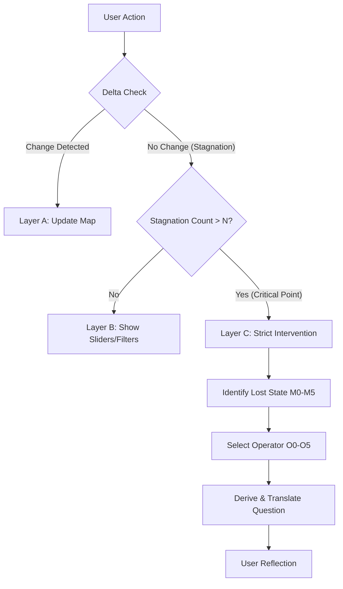

# 中核機能アーキテクチャ設計書 (structure-generation-core-architecture.md)

## 概要
本ドキュメントは、適応型学習システムの核となる「構造生成」および「迷子状態検知・介入」のロジックフロー定義である。システムのあらゆる挙動は、「教える」ことではなく「学習者の認知構造を可視化（変形）する」ことに奉仕する。

## 1. 介入の三層構造 (The 3-Layer Intervention Architecture)

システムは以下の順序で介入レベルを決定する。C層（問い）は、A/B層で解決不能な場合のみ発動する。

### Layer A: 構造空間 (Structural Space) - [Projection]
*   **役割**: 「事実」の投影。学習者の認識、外部リソース、操作ログを物理的な「地図」として配置する。
*   **拡張**: 必要に応じて、カスタマイズされたHTML/CSS/JSページとして構造を投影し、単なるノードグラフを超えた「体験」を提供する。
*   **アクション**: ノード追加、リンク接続、グループ化、Webページ生成。
*   **原則**: システムは地図を描くだけで、ルート（正解）は引かない。

### Layer B: 力学・状態 (Dynamics/State) - [Landscape]
*   **役割**: 「可能性」の提示。判断軸や比較のための「地形（坂道、壁、分岐）」を生成する。
*   **アクション**: スライダー生成、並び替えソート、フィルタリングUI。
*   **原則**: 「どちらが良い」ではなく「こちらに行くとこうなる」というパラメータ変化を可視化する。

### Layer C: 介入・問い (Intervention/Question) - [Questioning]
*   **役割**: 「視点」の転換。構造的なデッドロックを打破するための、意味構造（Semantics）に基づいた問い。
*   **アクション**: 視点操作子 (O0~O5) に基づく問いの投げかけ。
*   **原則**: 以前のテンプレート方式は廃止。状態から導出されたSemantics（意味構造）のみをAIが翻訳して提示する。

## 2. 臨界点 (Critical Point) のロジック

**定義**: システムの穏やかな介入（Layer A/B）では解決不能な「構造的デッドロック」状態。学習者が同じ場所を旋回し始めた時、システムは「静観」をやめ「介入」に転じる。



## 3. モジュール構成 (Core Modules)

*   **Semantic Bridge**: ユーザー入力（自然言語）をシステムが理解可能な「意図クラス」へ変換する。ここでは「AIサービス（実装はOpenAI/Local Logic等問わない）」が利用され、あくまで「翻訳機」として機能する。
*   **Structural Fact Analyzer**: ログから客観的な事実（回数、変化量、パターン）のみを抽出する計算機。感情分析は行わない。
*   **Homeostatic Controller**: 「介入すべきか、静観すべきか」を決定する制御塔。臨界点判定を行う。Layer A/B/Cのスイッチングを担当する。
*   **Learner Support Service**: 決定された介入内容を具体的なコンテンツ（地図、選択肢、カスタムHTML/JSコード）に変換する生成器。
    *   **共存表示ロジック**: 迷子状態に基づいてコンポーネント表示を決定（ルールベース、AI判断不要）
    *   **段階的生成**: 意図検出→ノード抽出→選択肢生成→sandbox生成（条件付き）

## 4. データモデル連動

### Structural Fact (事実)
```typescript
interface StructuralFact {
  history: OperatorLog[];
  delta: StructuralDelta;
  stagnationCount: number;
}
```

### Lost State (状態)
M0〜M5の状態は、`StructuralFact` から一意に導出される。
**RESOLVED**は迷子状態が解消された状態を表す。

### Intervention (介入)
```typescript
type Intervention = 
  | { type: 'PROJECTION', nodes: Node[] }      // Layer A
  | { type: 'LANDSCAPE', options: Option[] }   // Layer B
  | { type: 'QUESTION', semantics: Semantics } // Layer C
  | { type: 'SANDBOX', code: SandboxCode }     // RESOLVED時のみ
```